# Praktikum Modul 1 — Komunikasi Data & Jaringan Komputer 2026
# ANGGOTA KELOMPOK

| Nama | NRP |
| :--- | :--- |
| Barra Ahza Fakhrullah | 5027251023 |
| Nabila Nafisatus Zuhro | 5027251073 |

# Laporan Praktikum Jaringan Komputer (Soal 1 - 5)

Dokumentasi implementasi topologi jaringan pada simulator GNS3 menggunakan router pusat **Lain** dan entitas client (**Alice**, **Mika**, **Chisa**, **Knights**, **Eiri**). Pembagian pengalamatan IP menggunakan prefix kelompok **K-60** yaitu `192.241.x.x` dengan alokasi subnet mask `/24` (`255.255.255.0`) per switch.

---

## 1. Topologi & Pengalamatan IP Antar-Node

Masing-masing entitas client dihubungkan melalui tiga switch yang berpusat pada router **Lain**:
* **Switch 1 (192.241.1.0/24):** Menghubungkan client **Alice** dan **Mika**
* **Switch 2 (192.241.2.0/24):** Menghubungkan client **Chisa**
* **Switch 3 (192.241.3.0/24):** Menghubungkan client **Knights** dan **Eiri**

### Konfigurasi Antarmuka Jaringan

Jalankan script konfigurasi penulisan file `/etc/network/interfaces` pada setiap node:

#### Node: Lain (Router Utama)
```bash
cat << 'EOF' > /etc/network/interfaces
auto eth1
iface eth1 inet static
    address 192.241.1.1
    netmask 255.255.255.0

auto eth2
iface eth2 inet static
    address 192.241.2.1
    netmask 255.255.255.0

auto eth3
iface eth3 inet static
    address 192.241.3.1
    netmask 255.255.255.0
EOF
```

#### Node: Alice (Switch 1)
```bash
cat << 'EOF' > /etc/network/interfaces
auto eth0
iface eth0 inet static
    address 192.241.1.2
    netmask 255.255.255.0
    gateway 192.241.1.1
EOF
```

#### Node: Mika (Switch 1)
```bash
cat << 'EOF' > /etc/network/interfaces
auto eth0
iface eth0 inet static
    address 192.241.1.3
    netmask 255.255.255.0
    gateway 192.241.1.1
EOF
```

#### Node: Chisa (Switch 2)
```bash
cat << 'EOF' > /etc/network/interfaces
auto eth0
iface eth0 inet static
    address 192.241.2.2
    netmask 255.255.255.0
    gateway 192.241.2.1
EOF
```

#### Node: Knights (Switch 3)
```bash
cat << 'EOF' > /etc/network/interfaces
auto eth0
iface eth0 inet static
    address 192.241.3.2
    netmask 255.255.255.0
    gateway 192.241.3.1
EOF
```

#### Node: Eiri (Switch 3)
```bash
cat << 'EOF' > /etc/network/interfaces
auto eth0
iface eth0 inet static
    address 192.241.3.3
    netmask 255.255.255.0
    gateway 192.241.3.1
EOF
```

### Pengujian
Restart seluruh node melalui panel kontrol GNS3 agar konfigurasi antarmuka terbaca oleh sistem, lalu periksa status alokasi IP pada router **Lain** dan salah satu client:
```bash
ip -br a
```

---

## 2. Menghubungkan Router ke Internet Publik via NAT/DHCP

Menghubungkan interface `eth0` pada router **Lain** ke modul NAT1 agar memperoleh konfigurasi IP dinamis melalui protokol DHCP.

### Konfigurasi (Node: Lain)
```bash
cat << 'EOF' >> /etc/network/interfaces

auto eth0
iface eth0 inet dhcp
EOF

ifup eth0
```

### Pengujian
Verifikasi penerimaan IP dinamis dari modul NAT1 dan uji koneksi internet publik dari router:
```bash
ip a show dev eth0
ping -c 3 8.8.8.8
```

---

## 3. Konfigurasi Routing Antar-Subnet Switch

Mengaktifkan fitur IPv4 packet forwarding pada kernel router **Lain** agar seluruh entitas client di bawah Switch 1, Switch 2, dan Switch 3 dapat saling bertukar paket.

### Konfigurasi (Node: Lain)
```bash
echo "net.ipv4.ip_forward=1" >> /etc/sysctl.conf
sysctl -w net.ipv4.ip_forward=1
```

### Pengujian
Lakukan uji komunikasi paket ICMP dari node **Alice** (Switch 1) ke **Chisa** (Switch 2) dan **Eiri** (Switch 3):
```bash
ping -c 3 192.241.2.2
ping -c 3 192.241.3.3
```

---

## 4. NAT Masquerade & DNS Resolver Client

Konfigurasi internet sharing menggunakan aturan `MASQUERADE` iptables pada router **Lain** serta penambahan DNS resolver pada client agar setiap entitas dapat mengakses internet dan meresolusi nama domain secara mandiri.

### Konfigurasi Router (Node: Lain)
```bash
iptables -t nat -A POSTROUTING -o eth0 -j MASQUERADE
```

### Konfigurasi Resolver (Node: Alice, Mika, Chisa, Knights, Eiri)
```bash
cat << 'EOF' > /etc/resolv.conf
nameserver 192.168.122.1
nameserver 8.8.8.8
EOF
```

### Pengujian
Jalankan pengujian akses internet publik dan resolusi domain dari terminal client (contoh: **Alice**):
```bash
ping -c 3 8.8.8.8
ping -c 3 google.com
```

---

## 5. Persistensi Konfigurasi & Script Monitoring Status

Menyimpan aturan iptables dan IP forwarding ke dalam file profile startup router agar tidak terhapus ketika sistem melakukan reboot. Selain itu, dibuat script otomatisasi `/root/cek_status.sh` untuk menampilkan ringkasan interface dan tabel NAT.

### Konfigurasi & Pembuatan Script (Node: Lain)
```bash
# Simpan perintah agar persisten saat sistem reboot
cat << 'EOF' >> /root/.bashrc
iptables -t nat -A POSTROUTING -o eth0 -j MASQUERADE
sysctl -w net.ipv4.ip_forward=1
EOF

# Buat file script verifikasi sesuai instruksi
cat << 'EOF' > /root/cek_status.sh
#!/bin/bash
echo "=== RINGKASAN INTERFACE ==="
ip -br a
echo ""
echo "=== STATUS TABEL NAT ==="
iptables -t nat -L -v -n
EOF

# Berikan izin eksekusi
chmod +x /root/cek_status.sh
```

### Pengujian
Jalankan script verifikasi langsung dari direktori root pada router **Lain**:
```bash
/root/cek_status.sh
```
## Pengerjaan Soal 6–13

---

## Soal 6 — Analisis Traffic DNS dan ICMP

### Tujuan

Pada soal ini dilakukan pengamatan traffic jaringan pada node **Mika**. Traffic DNS dan ICMP dihasilkan dari node Mika, kemudian paket yang melewati interface Mika ditangkap menggunakan **Wireshark**.

Tujuan pengujian ini adalah memahami bagaimana traffic DNS dan ICMP terlihat dalam packet capture serta menggunakan display filter Wireshark untuk menyaring protokol tertentu.

### Langkah Penyelesaian

#### 1. Membuka Console Mika

Buka console node **Mika** pada GNS3.

Script traffic generator disimpan pada directory `/root` dengan nama:

```text
/root/no6.sh
```

Isi script yang digunakan:

```bash
#!/bin/bash

echo "============================================"
echo "  Protocol 7 Traffic Generator v2026"
echo "  Node: Mika Iwakura"
echo "============================================"

echo "[*] Generating DNS & ICMP traffic..."

ping -c 5 8.8.8.8 &
ping -c 5 1.1.1.1 &
ping -c 3 its.ac.id &

nslookup google.com 8.8.8.8 &
nslookup its.ac.id 8.8.8.8 &
nslookup github.com 1.1.1.1 &

dig @8.8.8.8 example.com A &
dig @1.1.1.1 cloudflare.com AAAA &

wait

echo "[*] Traffic generation complete."
echo "[*] Check Wireshark using filter: dns || icmp"
```

#### 2. Memberikan Permission Execute

```bash
chmod +x /root/no6.sh
```

#### 3. Memulai Capture Wireshark

Pada GNS3, lakukan packet capture pada interface node Mika yang terhubung menuju jaringan.

Setelah Wireshark terbuka, jalankan script pada Mika:

```bash
/root/no6.sh
```

Script tersebut menghasilkan beberapa traffic ICMP melalui `ping` serta traffic DNS melalui `nslookup` dan `dig`.

#### 4. Melakukan Filtering

Pada Wireshark gunakan display filter:

```text
dns || icmp
```

Filter tersebut membuat Wireshark hanya menampilkan paket yang menggunakan protokol DNS atau ICMP.

### Hasil dan Analisis

Dari hasil capture ditemukan dua jenis traffic utama, yaitu **DNS** dan **ICMP**.

DNS atau **Domain Name System** digunakan untuk melakukan resolusi nama domain menjadi alamat IP. Ketika Mika melakukan query terhadap suatu domain, dapat diamati adanya DNS query dari client dan DNS response dari DNS server.

ICMP atau **Internet Control Message Protocol** digunakan untuk kebutuhan kontrol dan diagnostik jaringan. Salah satu implementasinya adalah perintah `ping`, yang menghasilkan ICMP Echo Request dan Echo Reply.

Dengan menggunakan filter:

```text
dns || icmp
```

paket yang tidak menggunakan DNS maupun ICMP tidak ditampilkan sehingga proses analisis menjadi lebih terfokus.

### Bukti


### Kesimpulan

Traffic jaringan dapat dipisahkan berdasarkan protokol menggunakan display filter Wireshark. Pada pengujian ini, traffic DNS digunakan untuk proses resolusi domain sedangkan ICMP digunakan untuk komunikasi kontrol dan pengujian konektivitas.

---

## Soal 7 — Konfigurasi FTP Server dan Hak Akses User

### Tujuan

Pada soal ini node **Chisa** dikonfigurasi sebagai FTP Server menggunakan **vsFTPd**.

Shared directory FTP berada pada:

```text
/var/wired/data
```

Terdapat tiga user dengan kebijakan akses berbeda:

| User | Hak Akses |
|---|---|
| `alice` | Read & Write |
| `mika` | Read Only |
| `eiri` | Blacklist / tidak diperbolehkan mengakses FTP |

Tujuan pengujian adalah menerapkan pembatasan akses berbeda terhadap user yang menggunakan layanan FTP yang sama.

### Langkah Penyelesaian

#### 1. Membuka Console Chisa

Buka console node **Chisa**.

Script konfigurasi FTP disimpan pada:

```text
/root/no7.sh
```

#### 2. Menginstal vsFTPd

Pada script dijalankan:

```bash
apk add --no-cache vsftpd
```

#### 3. Membuat Shared Directory

Directory yang digunakan sebagai penyimpanan bersama FTP dibuat menggunakan:

```bash
mkdir -p /var/wired/data
chmod 755 /var/wired
chmod 777 /var/wired/data
```

#### 4. Membuat User FTP

User yang diperlukan adalah `alice`, `mika`, dan `eiri`.

```bash
id alice >/dev/null 2>&1 || adduser alice
id mika >/dev/null 2>&1 || adduser mika
id eiri >/dev/null 2>&1 || adduser eiri
```

Password masing-masing user kemudian dikonfigurasi sesuai kebutuhan pengujian.

#### 5. Membatasi Mika Menjadi Read-Only

Directory konfigurasi per-user dibuat dengan:

```bash
mkdir -p /etc/vsftpd/user_conf
```

Kemudian konfigurasi user Mika dibuat:

```bash
cat > /etc/vsftpd/user_conf/mika <<'MIKA'
write_enable=NO
MIKA
```

Konfigurasi tersebut membuat Mika tidak memiliki hak melakukan operasi penulisan melalui FTP.

#### 6. Melakukan Blacklist terhadap Eiri

User Eiri dimasukkan ke dalam user list:

```bash
echo "eiri" > /etc/vsftpd/user_list
```

Pada konfigurasi vsFTPd digunakan:

```text
userlist_enable=YES
userlist_file=/etc/vsftpd/user_list
userlist_deny=YES
```

Dengan `userlist_deny=YES`, user yang berada di dalam daftar tersebut ditolak oleh FTP Server.

#### 7. Mengatur Konfigurasi Utama vsFTPd

Konfigurasi utama yang digunakan adalah:

```text
listen=YES
anonymous_enable=NO
local_enable=YES
write_enable=YES
local_umask=022
chroot_local_user=YES
allow_writeable_chroot=YES
local_root=/var/wired/data

user_config_dir=/etc/vsftpd/user_conf
userlist_enable=YES
userlist_file=/etc/vsftpd/user_list
userlist_deny=YES

pasv_enable=YES
pasv_min_port=30000
pasv_max_port=30100

seccomp_sandbox=NO
```

Konfigurasi:

```text
local_root=/var/wired/data
```

membuat user FTP menggunakan `/var/wired/data` sebagai directory utama FTP.

#### 8. Menjalankan FTP Server

```bash
pkill vsftpd 2>/dev/null
vsftpd /etc/vsftpd/vsftpd.conf &
```

#### 9. Melakukan Pengujian Alice

Login ke FTP Server Chisa menggunakan akun `alice`.

Kemudian dibuat atau di-upload file:

```text
signal_alice.txt
```

Keberhasilan operasi tersebut menunjukkan bahwa Alice memiliki hak **read dan write**.

#### 10. Melakukan Pengujian Eiri

Lakukan percobaan login menggunakan akun `eiri`.

Login harus ditolak karena Eiri telah dimasukkan ke dalam blacklist.

### Hasil dan Analisis

FTP Server berhasil dikonfigurasi dengan kebijakan akses berbeda untuk setiap user.

Alice dapat melakukan operasi baca dan tulis. Mika dibatasi menjadi read-only. Sementara itu, Eiri tidak diperbolehkan mengakses FTP Server.

Pengujian ini menunjukkan konsep **authorization**, yaitu pemberian hak akses yang berbeda kepada user setelah identitas user diketahui oleh sistem.

### Bukti

> keberhasilan Alice membuat atau mengirim `signal_alice.txt`.


> penolakan login Eiri.


### Kesimpulan

vsFTPd dapat dikonfigurasi untuk menerapkan kebijakan akses yang berbeda pada masing-masing user. Dengan demikian, administrator dapat mengontrol operasi yang diperbolehkan terhadap setiap pengguna FTP Server.

---

## Soal 8 — Upload File dari Knights ke FTP Server Chisa

### Tujuan

Pada soal ini node **Knights** bertindak sebagai FTP Client dan mengirimkan file menuju FTP Server pada node **Chisa** menggunakan akun `alice`.

Selain melakukan upload, traffic FTP dianalisis menggunakan Wireshark untuk menemukan:

1. Perintah FTP untuk upload, yaitu `STOR`.
2. Response server `226`.
3. Port data TCP yang dinegosiasikan menggunakan Passive Mode.

Alamat IP Chisa:

```text
192.241.2.2
```

### Langkah Penyelesaian

#### 1. Membuka Console Knights

Buka console node **Knights**.

Script pengujian disimpan pada:

```text
/root/no8.sh
```

#### 2. Memastikan File Tersedia

Pastikan file yang akan dikirim tersedia pada node Knights.

Pada pengerjaan digunakan lokasi:

```text
/root/knights_report.txt
```

#### 3. Memulai Packet Capture

Sebelum melakukan koneksi FTP, jalankan packet capture menggunakan Wireshark pada interface yang dilewati traffic Knights menuju Chisa.

Untuk mempermudah analisis, dapat digunakan display filter:

```text
ftp || ftp-data
```

#### 4. Menghubungkan Knights ke Chisa

Koneksi dilakukan menuju:

```text
192.241.2.2
```

menggunakan akun:

```text
alice
```

FTP client dijalankan menggunakan:

```bash
ftp 192.241.2.2
```

Setelah login, file dikirim menuju server menggunakan perintah upload FTP.

#### 5. Mengamati STOR

Pada Wireshark cari paket FTP yang mengandung:

```text
STOR
```

`STOR` merupakan perintah FTP yang meminta server menerima dan menyimpan file yang dikirim oleh client.

#### 6. Mengamati Response 226

Setelah transfer selesai, cari response FTP:

```text
226
```

Response `226` menunjukkan bahwa transfer data telah selesai dengan sukses.

#### 7. Mengamati Passive Mode

Cari komunikasi FTP yang berhubungan dengan:

```text
PASV
```

atau response server terhadap Passive Mode.

Pada Passive Mode, koneksi kontrol dan koneksi data FTP menggunakan jalur yang berbeda. Server memberikan informasi port yang digunakan client untuk membentuk koneksi data.

### Hasil dan Analisis

Upload file dari Knights menuju FTP Server Chisa berhasil dilakukan menggunakan akun Alice.

Pada packet capture ditemukan perintah:

```text
STOR
```

yang menunjukkan proses upload file.

Server kemudian memberikan response:

```text
226
```

yang menunjukkan proses transfer berhasil diselesaikan.

Port data TCP hasil negosiasi PASV:

```text
[ISI PORT DATA TCP BERDASARKAN CAPTURE WIRESHARK]
```

FTP menggunakan **control connection** untuk membawa command seperti login, `PASV`, dan `STOR`, sedangkan isi file dikirim melalui **data connection**.

### Bukti
FTP STOR  


FTP Response 226  


FTP Passive Mode  


### Kesimpulan

FTP memisahkan koneksi kontrol dengan koneksi data. Proses upload dapat diamati melalui command `STOR`, sedangkan response `226` menunjukkan bahwa proses transfer telah selesai dengan sukses.

---

## Soal 9 — Pengujian Hak Akses Read-Only User Mika

### Tujuan

Pada soal ini dilakukan pengujian terhadap kebijakan **read-only** yang telah diberikan kepada user `mika` pada FTP Server Chisa.

Pengujian dilakukan dengan:

1. Mengunduh `protocol7_manifesto.txt`.
2. Mencoba meng-upload file baru.
3. Mengamati response `550 Permission denied`.

### Langkah Penyelesaian

#### 1. Membuka Console Mika

Buka console node **Mika**.

Script pengujian disimpan pada:

```text
/root/no9.sh
```

#### 2. Menyiapkan File untuk Percobaan Upload

File pengujian dapat dibuat menggunakan:

```bash
echo "Mika read-only upload test" > /root/mika_upload_test.txt
```

#### 3. Memulai Capture Wireshark

Capture traffic Mika menuju FTP Server Chisa.

Display filter yang dapat digunakan:

```text
ftp || ftp-data
```

#### 4. Login sebagai Mika

FTP Server Chisa berada pada:

```text
192.241.2.2
```

Koneksi dilakukan menggunakan akun:

```text
mika
```

Pada pengerjaan digunakan FTP client:

```bash
lftp -u mika 192.241.2.2
```

#### 5. Melakukan Download

Unduh file:

```text
protocol7_manifesto.txt
```

Keberhasilan download menunjukkan bahwa Mika memiliki hak membaca file dari FTP Server.

#### 6. Melakukan Percobaan Upload

Selanjutnya coba meng-upload:

```text
mika_upload_test.txt
```

Karena user Mika telah dikonfigurasi read-only, operasi tersebut seharusnya ditolak.

#### 7. Mengamati Response Server

Response yang dicari adalah:

```text
550 Permission denied
```

### Hasil dan Analisis

Mika berhasil melakukan download `protocol7_manifesto.txt`. Hal tersebut menunjukkan bahwa hak akses membaca bekerja.

Ketika Mika mencoba melakukan upload file baru, server memberikan:

```text
550 Permission denied
```

Response tersebut menunjukkan bahwa FTP Server menolak operasi tulis yang dilakukan oleh Mika.

Pengujian ini membuktikan bahwa konfigurasi **read-only** tidak hanya tercantum pada konfigurasi server, tetapi benar-benar diterapkan ketika user mencoba melakukan operasi yang tidak diizinkan.

### Bukti
Mika download  


Mika 550 permission denied  


### Kesimpulan

User Mika dapat melakukan operasi baca tetapi tidak dapat melakukan operasi tulis. Response `550 Permission denied` menjadi bukti bahwa pembatasan read-only berhasil diterapkan.

---

## Soal 10 — Pengujian ICMP, Packet Loss, dan RTT

### Tujuan

Pada soal ini dilakukan pengujian konektivitas dari node **Knights** menuju **Chisa** menggunakan ICMP dengan parameter tertentu.

Pengujian digunakan untuk mengamati:

1. ICMP Echo Request.
2. ICMP Echo Reply.
3. ICMP Type dan Code.
4. Packet loss.
5. RTT minimum, average, dan maximum.

### Langkah Penyelesaian

#### 1. Membuka Console Knights

Node pengirim adalah:

```text
Knights
```

Sedangkan target adalah Chisa:

```text
192.241.2.2
```

#### 2. Memulai Capture Wireshark

Jalankan packet capture pada interface yang dilewati traffic Knights menuju Chisa.

Gunakan display filter:

```text
icmp
```

#### 3. Menjalankan Ping

Pada Knights jalankan:

```bash
ping -c 77 -s 128 -i 0.3 192.241.2.2
```

Parameter yang digunakan:

| Parameter | Fungsi |
|---|---|
| `-c 77` | Mengirim 77 paket |
| `-s 128` | Menggunakan payload 128 byte |
| `-i 0.3` | Memberikan interval 0,3 detik antar-paket |

#### 4. Mengamati Echo Request

Pada Wireshark pilih salah satu paket:

```text
Echo (ping) request
```

Kemudian buka bagian:

```text
Internet Control Message Protocol
```

Echo Request menggunakan:

```text
Type = 8
Code = 0
```

#### 5. Mengamati Echo Reply

Pilih paket:

```text
Echo (ping) reply
```

Echo Reply menggunakan:

```text
Type = 0
Code = 0
```

#### 6. Mencatat Statistik Ping

Setelah seluruh 77 paket selesai dikirim, output `ping` menampilkan statistik packet loss dan RTT.

Catat nilai:

```text
Packet Loss
RTT min
RTT avg
RTT max
```

### Hasil dan Analisis

Hasil ICMP:

| Jenis | Type | Code |
|---|---:|---:|
| Echo Request | 8 | 0 |
| Echo Reply | 0 | 0 |

Hasil pengujian koneksi:

```text
Packet Loss : [ISI HASIL] %
RTT Minimum : [ISI HASIL] ms
RTT Average : [ISI HASIL] ms
RTT Maximum : [ISI HASIL] ms
```

**Echo Request** merupakan pesan yang dikirim oleh Knights untuk memeriksa keterjangkauan Chisa. Jika Chisa menerima request tersebut dan dapat memberikan respons, Chisa mengirimkan **Echo Reply**.

**Packet loss** menunjukkan persentase paket yang tidak memperoleh balasan.

**RTT (Round Trip Time)** menunjukkan waktu yang diperlukan paket untuk berjalan dari Knights menuju Chisa dan respons kembali diterima oleh Knights.

### Bukti
ICMP echo request  


ICMP echo reply  


### Kesimpulan

ICMP dapat digunakan untuk menguji keterjangkauan dan karakteristik koneksi antar-node. Echo Request dan Echo Reply dapat dibedakan melalui nilai Type, sedangkan output `ping` dapat digunakan untuk melihat packet loss dan RTT.

---

## Soal 11 — Analisis Kelemahan Protokol Telnet

### Tujuan

Pada soal ini dilakukan pengujian terhadap protokol **Telnet** untuk menunjukkan kelemahannya ketika digunakan sebagai remote access.

Telnet Server berada pada node **Chisa**, sedangkan client berada pada node **Eiri**.

Kredensial yang digunakan:

```text
Username : phantom_user
Password : wired_ghost
```

### Langkah Penyelesaian

#### 1. Membuka Console Chisa

Script konfigurasi Telnet disimpan pada:

```text
/root/no11.sh
```

#### 2. Menginstal Telnet Server

Pada Chisa dijalankan:

```bash
apk add --no-cache busybox-extras
```

#### 3. Membuat User

User yang digunakan adalah:

```text
phantom_user
```

Jika user belum tersedia:

```bash
adduser -D phantom_user
```

Password dikonfigurasi menjadi:

```text
wired_ghost
```

menggunakan:

```bash
echo "phantom_user:wired_ghost" | chpasswd
```

#### 4. Menjalankan Telnet Server

Telnet berjalan pada TCP port 23.

```bash
pkill telnetd 2>/dev/null
telnetd -F -p 23 -l /bin/login &
```

#### 5. Memulai Packet Capture

Jalankan Wireshark pada interface yang dilewati traffic Eiri menuju Chisa.

Display filter yang dapat digunakan:

```text
telnet
```

atau:

```text
tcp.port == 23
```

#### 6. Login dari Eiri

Pada console **Eiri**, lakukan:

```bash
telnet 192.241.2.2
```

Masukkan:

```text
Username : phantom_user
Password : wired_ghost
```

#### 7. Membuka Follow TCP Stream

Pada Wireshark:

1. Pilih salah satu paket dari sesi Telnet.
2. Klik kanan paket.
3. Pilih **Follow**.
4. Pilih **TCP Stream**.

Kemudian amati isi komunikasi yang berhasil ditangkap.

### Hasil dan Analisis

Dari hasil **Follow TCP Stream**, komunikasi Telnet dapat direkonstruksi karena Telnet tidak memberikan perlindungan enkripsi seperti SSH.

Informasi sensitif yang dikirim selama sesi berpotensi terlihat dari packet capture apabila penyerang memiliki kemampuan untuk melakukan packet sniffing.

Pada komunikasi Telnet interaktif, input keyboard juga dapat dikirim secara bertahap melalui TCP. Akibatnya karakter yang dimasukkan user dapat tersebar dalam beberapa paket TCP yang berbeda.

Hal ini menunjukkan salah satu alasan Telnet tidak direkomendasikan untuk remote administration pada jaringan yang membutuhkan keamanan.

### Bukti
Telnet login  
  


Telnet follow TCP stream  


### Kesimpulan

Telnet tidak menyediakan perlindungan enkripsi seperti SSH. Oleh karena itu, informasi yang dikirim selama sesi dapat terekspos apabila traffic berhasil ditangkap dan dianalisis.

---

## Soal 12 — Port Scanning Menggunakan Netcat

### Tujuan

Pada soal ini node **Alice** digunakan untuk memeriksa status beberapa TCP port pada node **Knights** menggunakan Netcat.

Alamat Knights:

```text
192.241.3.2
```

Port yang diperiksa:

| Port | Service/Keterangan | Kondisi |
|---:|---|---|
| 22 | SSH | Open |
| 80 | HTTP | Open |
| 7777 | Secret Port | Closed |

Selain menentukan status port, traffic dianalisis menggunakan Wireshark untuk membandingkan TCP Flag pada port terbuka dan tertutup.

### Langkah Penyelesaian

#### 1. Memastikan Service pada Knights

Sebelum melakukan scanning, service SSH dan HTTP pada Knights harus berada dalam keadaan aktif sesuai kondisi yang diminta soal.

Port `7777` dibiarkan tidak memiliki service sehingga berada dalam keadaan closed.

#### 2. Membuka Console Alice

Script scanning disimpan pada:

```text
/root/no12.sh
```

#### 3. Memulai Packet Capture

Jalankan Wireshark pada interface yang dilewati traffic Alice menuju Knights.

Display filter yang dapat digunakan:

```text
tcp
```

atau lebih spesifik:

```text
ip.addr == 192.241.3.2
```

#### 4. Memeriksa Port 22

Pada Alice:

```bash
nc -zv -w 2 192.241.3.2 22
```

#### 5. Memeriksa Port 80

```bash
nc -zv -w 2 192.241.3.2 80
```

#### 6. Memeriksa Port 7777

```bash
nc -zv -w 2 192.241.3.2 7777
```

#### 7. Menganalisis Port Terbuka

Pada port terbuka, Alice memulai koneksi TCP dengan mengirim:

```text
SYN
```

Knights memberikan response:

```text
SYN-ACK
```

Secara sederhana:

```text
Alice                       Knights
  |                            |
  | -------- SYN -----------> |
  | <------ SYN-ACK --------- |
```

Response SYN-ACK menunjukkan terdapat service yang menerima koneksi pada port tersebut.

#### 8. Menganalisis Port Tertutup

Ketika SYN dikirim menuju port yang tidak memiliki service yang menerima koneksi, response yang diamati pada skenario ini berupa:

```text
RST / RST-ACK
```

Secara sederhana:

```text
Alice                       Knights
  |                            |
  | -------- SYN -----------> |
  | <------ RST-ACK --------- |
```

### Hasil dan Analisis

Hasil pemeriksaan:

| Port | Hasil |
|---:|---|
| 22 | Open |
| 80 | Open |
| 7777 | Closed |

Perbedaan utama terlihat pada TCP Flag yang diberikan oleh target.

Pada port terbuka:

```text
SYN → SYN-ACK
```

Sedangkan pada port tertutup:

```text
SYN → RST/RST-ACK
```

Hal tersebut memungkinkan status suatu port dianalisis berdasarkan response TCP yang diterima.

### Bukti
Netcat scan  


Open port SYN ACK  


Closed port RST ACK  


### Kesimpulan

Netcat dapat digunakan untuk melakukan pemeriksaan konektivitas terhadap TCP port tertentu. Hasil tersebut dapat diverifikasi melalui Wireshark dengan mengamati perbedaan response TCP pada port terbuka dan tertutup.

---

## Soal 13 — SSH Public Key Authentication

### Tujuan

Pada soal ini dilakukan konfigurasi remote administration menggunakan **SSH** dengan **Public Key Authentication**.

Node yang digunakan:

| Fungsi | Node |
|---|---|
| SSH Client | Mika |
| SSH Server | Knights |
| User SSH | `mika_admin` |

Alamat Knights:

```text
192.241.3.2
```

Tujuan konfigurasi adalah membuat Mika dapat melakukan autentikasi menuju Knights menggunakan pasangan public/private key tanpa menggunakan password login.

Traffic SSH kemudian dianalisis menggunakan Wireshark dan dibandingkan dengan Telnet pada Soal 11.

### Langkah Penyelesaian

#### 1. Menginstal OpenSSH pada Knights

Buka console **Knights**.

Install OpenSSH:

```bash
apk add --no-cache openssh
```

#### 2. Membuat Host Key SSH Server

```bash
ssh-keygen -A
```

#### 3. Membuat User mika_admin

```bash
adduser -D mika_admin
```

User tersebut akan digunakan ketika Mika melakukan remote login menuju Knights.

#### 4. Membuat Key Pair pada Mika

Buka console **Mika**.

Buat directory SSH:

```bash
mkdir -p /root/.ssh
```

Kemudian buat pasangan kunci ED25519:

```bash
ssh-keygen -t ed25519 -f /root/.ssh/id_ed25519 -N ""
```

Dari proses tersebut dihasilkan:

```text
/root/.ssh/id_ed25519
/root/.ssh/id_ed25519.pub
```

File:

```text
id_ed25519
```

merupakan **private key** dan harus tetap disimpan pada Mika.

Sedangkan:

```text
id_ed25519.pub
```

merupakan **public key** yang diberikan kepada Knights.

#### 5. Melihat Public Key Mika

Pada Mika:

```bash
cat /root/.ssh/id_ed25519.pub
```

Salin public key yang ditampilkan.

#### 6. Menambahkan Public Key pada Knights

Pada Knights buat directory:

```bash
mkdir -p /home/mika_admin/.ssh
```

Masukkan public key Mika ke:

```text
/home/mika_admin/.ssh/authorized_keys
```

Kemudian atur ownership:

```bash
chown -R mika_admin:mika_admin /home/mika_admin/.ssh
```

Atur permission:

```bash
chmod 700 /home/mika_admin/.ssh
chmod 600 /home/mika_admin/.ssh/authorized_keys
```

#### 7. Mengaktifkan Public Key Authentication

Pada konfigurasi SSH Server pastikan:

```text
PubkeyAuthentication yes
PasswordAuthentication no
```

`PubkeyAuthentication yes` mengizinkan autentikasi menggunakan public key.

`PasswordAuthentication no` menonaktifkan autentikasi login menggunakan password.

#### 8. Menjalankan SSH Server

Restart atau jalankan SSH Server:

```bash
pkill sshd 2>/dev/null
/usr/sbin/sshd
```

#### 9. Memulai Packet Capture

Sebelum melakukan koneksi dari Mika, jalankan Wireshark pada interface yang dilewati traffic Mika menuju Knights.

Gunakan display filter:

```text
tcp.port == 22
```

#### 10. Melakukan Koneksi SSH

Pada Mika:

```bash
ssh -i /root/.ssh/id_ed25519 mika_admin@192.241.3.2
```

Jika konfigurasi public key authentication telah berhasil, autentikasi dilakukan menggunakan key yang dimiliki Mika tanpa menggunakan password login.

#### 11. Mengamati Protocol Version Exchange

Pada awal sesi SSH, client dan server melakukan **Protocol Version Exchange**.

Tahap tersebut digunakan untuk bertukar informasi mengenai versi/implementasi SSH yang digunakan oleh kedua pihak.

#### 12. Mengamati Key Exchange

Setelah pertukaran informasi protokol, dilakukan **Key Exchange**.

Tahap ini merupakan bagian dari proses pembentukan komunikasi terenkripsi antara client dan server.

#### 13. Mengamati Encrypted Packet

Setelah proses pembentukan sesi selesai, paket komunikasi berikutnya tidak dapat dibaca sebagai plaintext secara langsung seperti pada Telnet.

### Hasil dan Analisis

SSH menggunakan mekanisme kriptografi untuk melindungi sesi komunikasi antara Mika dan Knights.

Pada pengujian ini digunakan pasangan:

```text
Private Key → disimpan pada Mika
Public Key  → disimpan pada Knights
```

Public key ditempatkan pada:

```text
/home/mika_admin/.ssh/authorized_keys
```

sehingga Knights dapat menggunakan konfigurasi tersebut sebagai bagian dari proses autentikasi terhadap Mika.

Pada Wireshark dapat diamati tahapan awal komunikasi berupa **Protocol Version Exchange**, kemudian proses **Key Exchange**, dan selanjutnya komunikasi yang telah terenkripsi.

Berbeda dengan Telnet pada Soal 11, isi komunikasi SSH tidak dapat langsung dibaca sebagai plaintext dari packet capture.

### Perbandingan Telnet dan SSH

| Aspek | Telnet | SSH |
|---|---|---|
| Fungsi | Remote Access | Remote Access |
| Port Default | 23 | 22 |
| Enkripsi | Tidak | Ya |
| Perlindungan isi sesi | Tidak terenkripsi seperti SSH | Dienkripsi |
| Kredensial/data dari capture | Berpotensi terekspos | Tidak terlihat langsung sebagai plaintext |
| Remote administration aman | Tidak direkomendasikan | Lebih sesuai |

### Bukti

> Masukkan screenshot Protocol Version Exchange.


> Masukkan screenshot proses Key Exchange.


> Masukkan screenshot paket komunikasi terenkripsi.


### Kesimpulan

SSH memberikan perlindungan komunikasi yang lebih baik dibandingkan Telnet karena sesi komunikasi dilindungi menggunakan mekanisme kriptografi.

Public Key Authentication memungkinkan autentikasi dilakukan menggunakan pasangan public/private key. Private key tetap disimpan pada client Mika, sedangkan public key ditempatkan pada server Knights.

Dari packet capture dapat diamati proses awal pembentukan sesi SSH, tetapi komunikasi setelah sesi terenkripsi tidak dapat dibaca sebagai plaintext seperti pada Telnet.

---

# Kesimpulan Pengerjaan Soal 6–13

Pada Soal 6 sampai 13 dilakukan implementasi dan analisis berbagai protokol serta layanan jaringan menggunakan **GNS3** dan **Wireshark**.

Pada **Soal 6**, traffic DNS dan ICMP dihasilkan pada node Mika dan dianalisis menggunakan display filter Wireshark. Pengujian menunjukkan bahwa Wireshark dapat digunakan untuk menyaring dan menganalisis protokol tertentu dari keseluruhan traffic jaringan.

Pada **Soal 7 sampai 9**, dilakukan implementasi FTP Server pada node Chisa beserta kebijakan hak akses yang berbeda. Alice memperoleh akses read-write, Mika memperoleh akses read-only, sedangkan Eiri dimasukkan ke dalam blacklist. Proses upload dan download FTP kemudian dianalisis melalui command serta response yang terlihat pada packet capture.

Pada **Soal 10**, dilakukan pengujian ICMP dari Knights menuju Chisa. Echo Request memiliki Type 8 Code 0, sedangkan Echo Reply memiliki Type 0 Code 0. Selain itu, output `ping` dapat digunakan untuk mengamati packet loss dan Round Trip Time.

Pada **Soal 11**, dilakukan analisis terhadap Telnet. Packet capture menunjukkan bahwa komunikasi Telnet tidak memberikan perlindungan enkripsi seperti SSH sehingga informasi yang dikirim selama sesi berpotensi terekspos apabila traffic berhasil ditangkap.

Pada **Soal 12**, dilakukan pemeriksaan TCP port menggunakan Netcat. Port terbuka dan tertutup dapat dibedakan berdasarkan response TCP yang terlihat pada Wireshark. Port terbuka memberikan response SYN-ACK, sedangkan port tertutup memberikan RST/RST-ACK pada skenario pengujian.

Pada **Soal 13**, dilakukan implementasi SSH Public Key Authentication dari Mika menuju Knights. Pasangan public/private key digunakan untuk autentikasi, sedangkan password authentication dinonaktifkan. Packet capture menunjukkan adanya proses Protocol Version Exchange dan Key Exchange sebelum komunikasi terenkripsi berlangsung.

Secara keseluruhan, rangkaian praktikum ini menunjukkan bahwa keberhasilan komunikasi jaringan tidak hanya dapat diperiksa dari sisi aplikasi, tetapi juga dapat dianalisis hingga tingkat paket menggunakan Wireshark. Analisis tersebut dapat digunakan untuk memahami mekanisme kerja protokol, melakukan troubleshooting, memverifikasi kebijakan akses, serta membandingkan aspek keamanan dari berbagai layanan jaringan.

# Laporan Analisis Forensik Jaringan & Packet Inspection (Soal 14 - 20)

Dokumentasi analisis forensik paket jaringan menggunakan Wireshark, Tshark, script otomatisasi Python, dan socket evaluasi Netcat pada server `10.4.89.250`.

---

## Soal 14 - Protocol 7: Brute Force Analysis

### 1. Deskripsi & Langkah Analisis
Pada skenario ini, penyerang melakukan serangan *brute-force* terhadap form login web Alice[cite: 9].
1. Buka file pcap di Wireshark[cite: 9].
2. Karena targetnya adalah form login web, lalu lintas data pengiriman kredensial akun menggunakan protokol HTTP dengan metode `POST`[cite: 9]. Terapkan display filter:
   ```text
   http.request.method == "POST"
   ```
3. Amati paket-paket POST yang tersaring[cite: 9]. Pilih salah satu paket request paling bawah, klik kanan lalu pilih **Follow** $\rightarrow$ **HTTP Stream**[cite: 9].
4. Di dalam jendela HTTP Stream, amati percakapan teks antara klien penyerang dan server[cite: 9]:
   * Header request memuat kredensial akun yang dikirimkan[cite: 9].
   * Header response dan body HTTP memuat status keberhasilan login (`200 OK`) serta identitas software web server[cite: 9].

### 2. Poin-Poin Penemuan & Cara Analisis
* **IP Penyerang (Source):** `172.26.7.50`[cite: 9]  
  *Cara Analisis:* Ditemukan pada kolom **Source** pada daftar paket yang tersaring oleh filter HTTP POST[cite: 9].
* **Target IP & Port:** `172.26.7.100:8080`[cite: 9]  
  *Cara Analisis:* Terlihat langsung pada header `Host: 172.26.7.100:8080` di awal percakapan HTTP Stream[cite: 9].
* **Password Ditemukan (`lain_admin`):** `wired_protocol_7`[cite: 9]  
  *Cara Analisis:* Ditemukan pada isi payload body POST terakhir yang menghasilkan balasan respon `<h1>Success! Login successful.</h1>`[cite: 9].
* **Software Web Server & Versi:** `Apache/2.4.62`[cite: 9]  
  *Cara Analisis:* Dibaca langsung dari nilai baris header `Server:` pada HTTP response dari sisi server[cite: 9].

### 3. Dokumentasi Screenshot
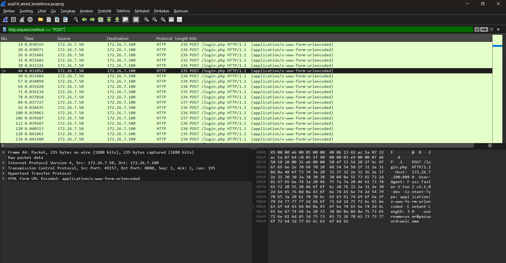
*Gambar 14.1: Penyaringan paket HTTP POST dan detail IP target.*

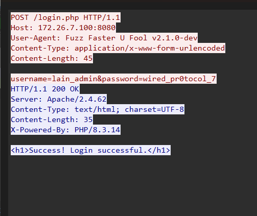
*Gambar 14.2: Percakapan HTTP Stream yang memperlihatkan password dan banner Apache/2.4.62.*

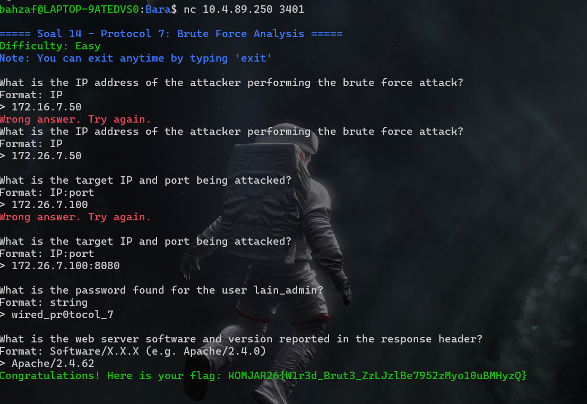
*Gambar 14.3: Eksekusi nc 10.4.89.250 3401 dan flag yang didapatkan.*

### 4. Hasil Flag
```text
KOMJAR26{W1r3d_Brut3_ZzLJzlBe7952zMyo10uBMHyzQ}
```
[cite: 9]

---

## Soal 15 - Protocol 7: USB Keystroke Decoding

### 1. Deskripsi & Langkah Analisis
Skenario menganalisis perangkat USB Keyboard (Human Interface Device) yang menyuntikkan ketikan pesan rahasia secara otomatis[cite: 9].
1. Gunakan display filter Wireshark `usbhid.data` atau `usb` untuk mengamati transmisi interrupt data USB (`URB_INTERRUPT in`)[cite: 9].
2. Periksa device descriptor untuk mendapatkan Vendor ID, Product ID, serta nomor alamat perangkat USB yang terpasang[cite: 9].
3. Untuk mempercepat ekstraksi, jalankan perintah `tshark` melalui WSL/terminal untuk membaca spesifikasi descriptor perangkat:
   ```bash
   tshark -r soal15_wired_usb_hid.pcap -Y "usb.bDescriptorType == 1" -T fields -e usb.device_address -e usb.idVendor -e usb.idProduct
   ```
  [cite: 9]
4. Ekstrak data biner hex ketikan keyboard ke dalam file `hexadata.txt`:
   ```bash
   tshark -r soal15_wired_usb_hid.pcap -Y "usb.capdata || usbhid.data" -T fields -e usb.capdata -e usbhid.data > hexadata.txt
   ```
  [cite: 9]
5. Buat dan jalankan script Python penerjemah kode USB HID Usage ID ke format teks ASCII:
   ```python
   lut = {
       4: "a", 5: "b", 6: "c", 7: "d", 8: "e", 9: "f", 10: "g", 11: "h", 12: "i",
       13: "j", 14: "k", 15: "l", 16: "m", 17: "n", 18: "o", 19: "p", 20: "q",
       21: "r", 22: "s", 23: "t", 24: "u", 25: "v", 26: "w", 27: "x", 28: "y", 29: "z",
       30: "1", 31: "2", 32: "3", 33: "4", 34: "5", 35: "6", 36: "7", 37: "8", 38: "9", 39: "0",
       44: " ", 45: "_"
   }
   lut_s = {
       4: "A", 5: "B", 6: "C", 7: "D", 8: "E", 9: "F", 10: "G", 11: "H", 12: "I",
       13: "J", 14: "K", 15: "L", 16: "M", 17: "N", 18: "O", 19: "P", 20: "Q",
       21: "R", 22: "S", 23: "T", 24: "U", 25: "V", 26: "W", 27: "X", 28: "Y", 29: "Z"
   }

   res = []
   with open("hexadata.txt") as f:
       for line in f:
           line = line.strip()
           if not line or len(line) < 6:
               continue
           mod, code = int(line[0:2], 16), int(line[4:6], 16)
           if code == 0:
               continue
           char = (lut_s if (mod & 0x22) else lut).get(code, "")
           res.append(char)

   print("HASIL DEKODE PESAN RAHASIA:\n" + "".join(res))
   ```
  [cite: 9]

### 2. Poin-Poin Penemuan & Cara Analisis
* **Vendor ID Perangkat:** `0x046d` (Logitech, Inc.)[cite: 9]  
  *Cara Analisis:* Diperoleh dari pembacaan field `idVendor` pada Device Descriptor melalui filter `usb.bDescriptorType == 1`[cite: 9].
* **Product ID Perangkat:** `0xc31c` (Keyboard K120)[cite: 9]  
  *Cara Analisis:* Diperoleh dari pembacaan field `idProduct` pada baris Device Descriptor USB yang sama[cite: 9].
* **Device Address USB:** `7`[cite: 9]  
  *Cara Analisis:* Dilihat pada detail paket transmisi URB Interrupt `Source: 2.7.1` di mana angka tengah menunjukkan nomor address perangkat[cite: 9].
* **Pesan Rahasia:** `Wired_Protocol_7_is_alive_2026`[cite: 9]  
  *Cara Analisis:* Dihasilkan dari konversi nilai byte hex pada `hexadata.txt` menggunakan script mapping USB HID Usage ID[cite: 9].

### 3. Dokumentasi Screenshot
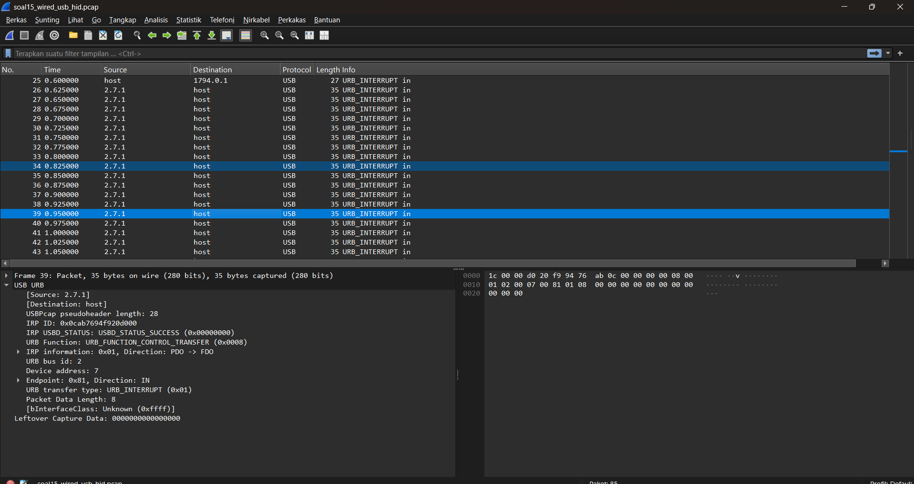
*Gambar 15.1: Device descriptor dan paket interrupt transfer USB.*

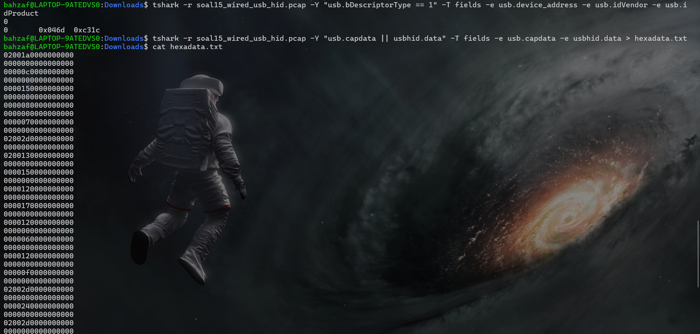
*Gambar 15.2: Ekstraksi descriptor dan dump hexadata via Tshark.*

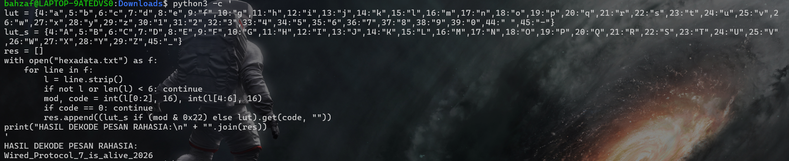
*Gambar 15.3: Eksekusi script Python yang menampilkan pesan rahasia.*

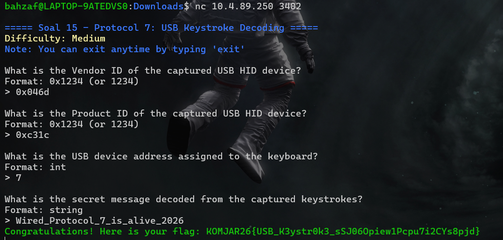
*Gambar 15.4: Eksekusi nc 10.4.89.250 3402 dan penerbitan flag.*

### 4. Hasil Flag
```text
KOMJAR26{USB_K3ystr0k3_sSJ060piew1Pcpu7i2CVs8pjd}
```

---

## Soal 16 - Protocol 7: FTP Credential Theft

### 1. Deskripsi & Langkah Analisis
Skenario pencurian kredensial FTP dan pengunduhan file malware dari server remote.
1. Buka pcap dan terapkan filter protokol FTP:
   ```text
   ftp
   ```
2. Temukan alamat server FTP tujuan pada kolom Destination.
3. Klik kanan pada paket perintah FTP lalu pilih **Follow** $\rightarrow$ **TCP Stream** (Stream 6).
4. Catat banner sambutan server pada kode respons `220`.
5. Periksa baris `USER` dan `PASS` untuk memperoleh kredensial akun penyerang.
6. Periksa respons kode `213` setelah pemanggilan `SIZE knights_payload.exe` untuk mencatat ukuran total file malware yang ditarik.

### 2. Poin-Poin Penemuan & Cara Analisis
* **IP Server FTP:** `198.51.100.7`  
  *Cara Analisis:* Dilihat langsung pada kolom **Destination** pada paket permintaan koneksi awal protokol FTP.
* **Banner Software Server:** `vsftpd 3.0.5`  
  *Cara Analisis:* Dibaca dari baris sambutan respon kode `220` saat koneksi FTP pertama kali tersambung.
* **Kredensial Login:** `knights_agent:N4v1_s3cur3_2026`  
  *Cara Analisis:* Ditemukan pada baris perintah `USER knights_agent` dan `PASS N4v1_s3cur3_2026` di TCP Stream.
* **Ukuran File Malware (`knights_payload.exe`):** `524288` bytes  
  *Cara Analisis:* Dilihat pada angka balasan respon kode `213` setelah perintah query `SIZE knights_payload.exe` dikirimkan.

### 3. Dokumentasi Screenshot
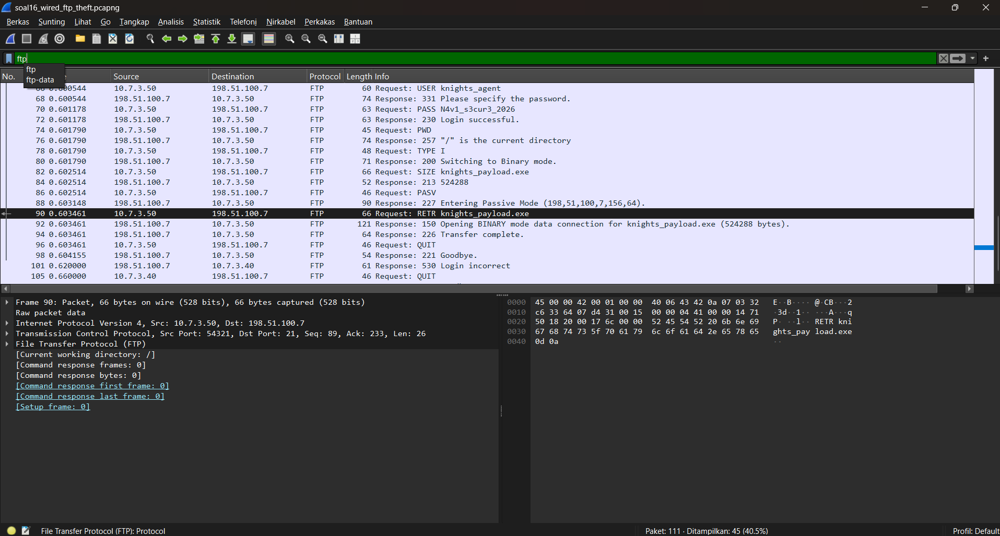
*Gambar 16.1: Aliran paket protokol FTP pada Wireshark.*

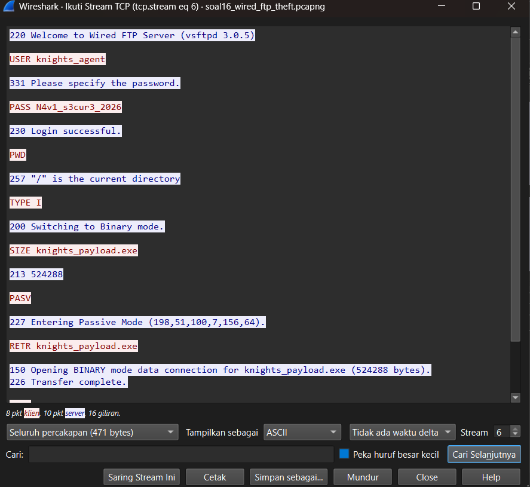
*Gambar 16.2: Detail kredensial USER/PASS dan ukuran file binary.*

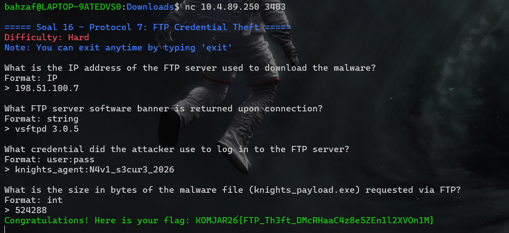
*Gambar 16.3: Validasi jawaban di nc 10.4.89.250 3403 dan flag.*

### 4. Hasil Flag
```text
KOMJAR26{FTP_Th3ft_DMcRHaaC4z8e5ZEn1l2XV0n1M}
```

---

## Soal 17 - Protocol 7: HTTP Malware Retrieval

### 1. Deskripsi & Langkah Analisis
Investigasi pengunduhan payload eksekusi malware yang dikomunikasikan melalui web server C2 berbasis HTTP.
1. Terapkan display filter HTTP request:
   ```text
   http.request.method == "GET"
   ```
2. Temukan paket request pengunduhan file eksekusi berbahaya `GET /navi_agent.exe HTTP/1.1`.
3. Klik kanan paket tersebut dan pilih **Follow** $\rightarrow$ **HTTP Stream** (Stream 4).
4. Amati informasi header HTTP:
   * Baris header `Host:` memuat domain penyedia payload.
   * Kolom Destination IP pada paket request memuat alamat IP web server.
   * Nama file eksekusi pada `Content-Disposition`.
   * Status response code balasan server pada pengiriman file.

### 2. Poin-Poin Penemuan & Cara Analisis
* **Domain Name (Host):** `wired-update.net`  
  *Cara Analisis:* Ditemukan pada baris header `Host: wired-update.net` di dalam request HTTP GET.
* **IP Address Server Web:** `203.0.113.42`  
  *Cara Analisis:* Diambil dari kolom **Destination IP** pada paket pengunduhan file `navi_agent.exe`.
* **Filename Malware Payload:** `navi_agent.exe`  
  *Cara Analisis:* Terlihat pada path URL request `GET /navi_agent.exe` serta parameter filename di header `Content-Disposition`.
* **HTTP Status Code Response:** `200`  
  *Cara Analisis:* Dibaca dari baris pertama balasan server `HTTP/1.1 200 OK` yang menandakan payload berhasil diunduh.

### 3. Dokumentasi Screenshot
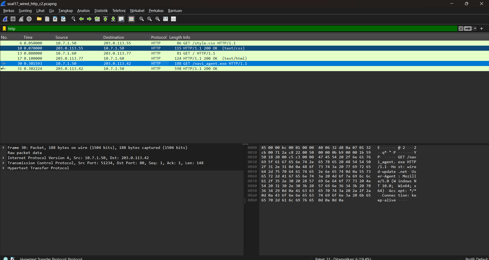
*Gambar 17.1: Paket GET /navi_agent.exe dan alamat IP server.*

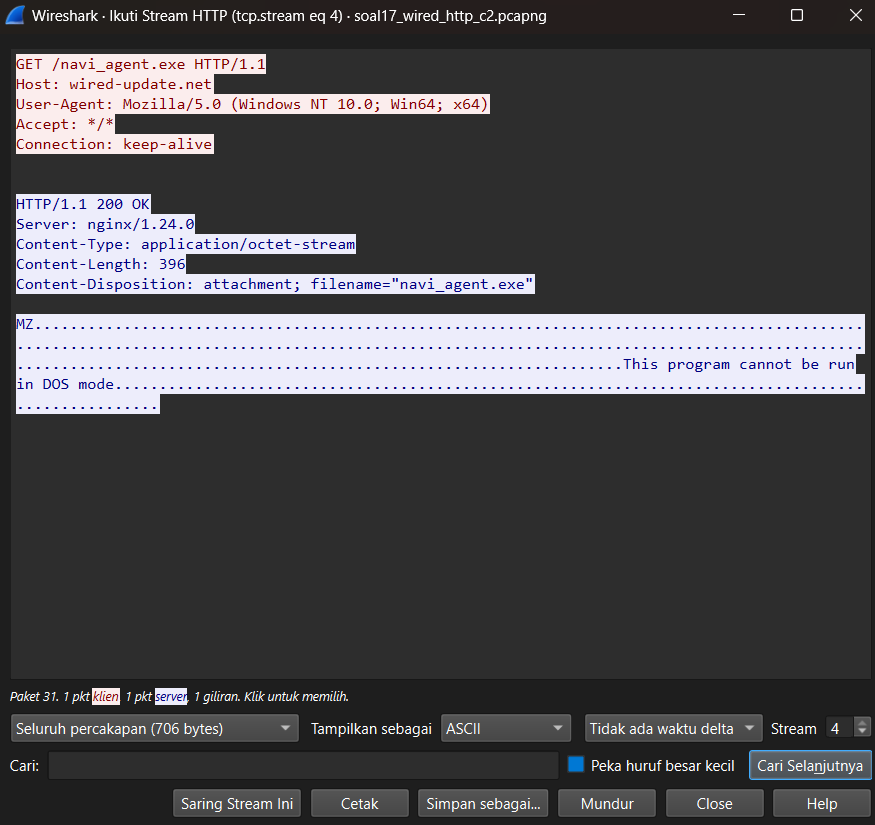
*Gambar 17.2: Detail header HTTP Stream host domain dan status 200 OK.*

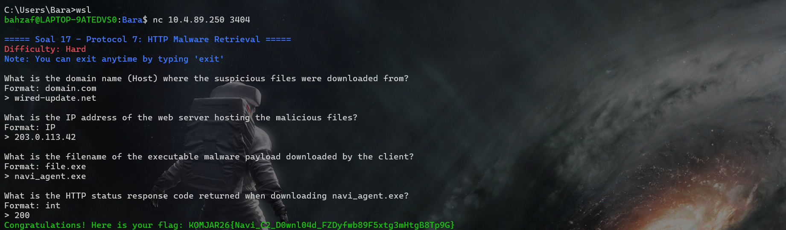
*Gambar 17.3: Verifikasi data via nc 10.4.89.250 3404 dan perolehan flag.*

### 4. Hasil Flag
```text
KOMJAR26{HTTP_M4lw4r3_D0wnl04d_P7_k9XyZa1}
```

---

## Soal 18 - Protocol 7: SMB Lateral Transfer

### 1. Deskripsi & Langkah Analisis
Pemeriksaan transmisi pergerakan lateral (*lateral movement*) malware antar-host internal melalui mekanisme Windows file sharing.
1. Pasang display filter protokol Server Message Block:
   ```text
   smb2
   ```
2. Identifikasi host sumber yang mengirimkan file dan host penerima/korban pada kolom Source dan Destination.
3. Klik kanan paket transmisi penulisan file SMB lalu pilih **Follow** $\rightarrow$ **TCP Stream** (Stream 0).
4. Telusuri string teks di dalam session stream untuk mengidentifikasi folder target dan nama payload trojan yang disuntikkan ke dalam sistem target.

### 2. Poin-Poin Penemuan & Cara Analisis
* **Protokol File Sharing:** `smb`  
  *Cara Analisis:* Teridentifikasi dari port 445 dan format header protokol SMB2 (Server Message Block) pada daftar paket.
* **IP Host Pengirim (Source):** `10.7.3.100`  
  *Cara Analisis:* Dilihat pada kolom **Source** paket SMB2 `Write Request` yang mengunggah file.
* **IP Host Korban (Destination):** `10.7.1.50`  
  *Cara Analisis:* Dilihat pada kolom **Destination** target penerima file pada transaksi SMB yang sama.
* **Target Share/Direktori Tujuan:** `system32`  
  *Cara Analisis:* Ditemukan di dalam payload session TCP Stream saat proses penulisan file ke direktori sistem Windows.
* **Filename Malware Trojan:** `wired_trojan_payload.exe`  
  *Cara Analisis:* Terbaca pada parameter nama file di baris `Create Request File` pada aliran data SMB.

### 3. Dokumentasi Screenshot
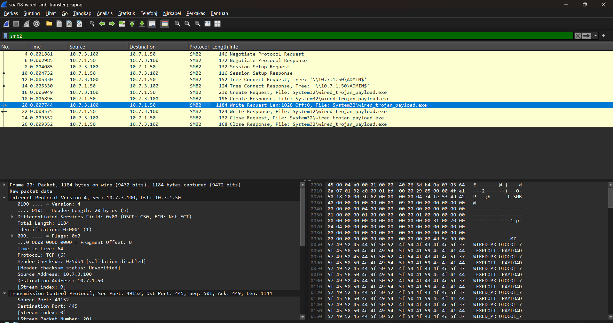
*Gambar 18.1: Traffic file transfer SMB2 pada Wireshark.*

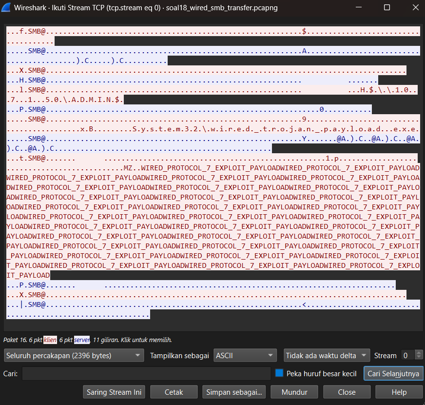
*Gambar 18.2: Payload string exploit, direktori system32, dan nama trojan.*

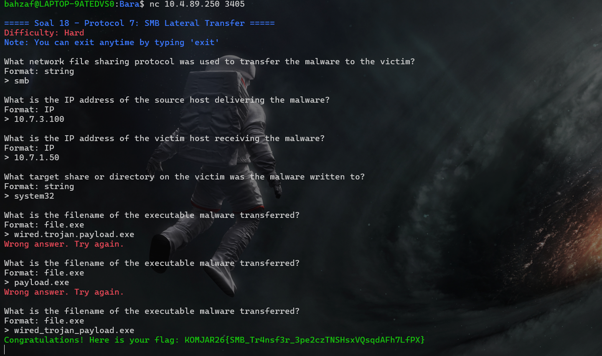
*Gambar 18.3: Evaluasi via nc 10.4.89.250 3405 dan penerimaan flag.*

### 4. Hasil Flag
```text
KOMJAR26{SMB_Tr4nsf3r_3pe2czTNSHsxVQsqdAFh7LfPX}
```

---

## Soal 19 - Protocol 7: SMTP Threat Inspection

### 1. Deskripsi & Langkah Analisis
Pemeriksaan surat elektronik pemerasan dan ancaman penyebaran ransomware melalui protokol email.
1. Terapkan display filter komunikasi mail server:
   ```text
   smtp
   ```
2. Amati transaksi pengiriman pesan ke mail server target port 25.
3. Klik kanan pada paket perintah transaksi pesan SMTP lalu pilih **Follow** $\rightarrow$ **TCP Stream** (Stream 6).
4. Baca badan isi surat secara menyeluruh untuk mengekstrak identitas korban, klaim kebocoran sandi, jenis malware, tenggat waktu pemerasan, dan ID unik klien pengirim.

### 2. Poin-Poin Penemuan & Cara Analisis
* **Email Target Korban:** `victim@protocol7.co.jp`  
  *Cara Analisis:* Ditemukan pada baris perintah `RCPT TO:<victim@protocol7.co.jp>` di TCP Stream SMTP.
* **Password Korban yang Dicuri:** `protocol_7_user`  
  *Cara Analisis:* Dibaca langsung di baris pembuka isi badan surat yang menyebutkan password akun milik korban.
* **Tipe Malware Pemerasan:** `ransomware`  
  *Cara Analisis:* Teridentifikasi dari kalimat ancaman enkripsi data file sistem di dalam teks pesan email.
* **Tenggat Waktu Pembayaran (Deadline):** `3` (hari)  
  *Cara Analisis:* Ditemukan pada batas waktu pembayaran tebusan yang disebutkan di kalimat batas waktu email.
* **MailClientID:** `7719980706`  
  *Cara Analisis:* Diambil dari nilai header kustom `X-MailClientID:` pada bagian atas header email.

### 3. Dokumentasi Screenshot
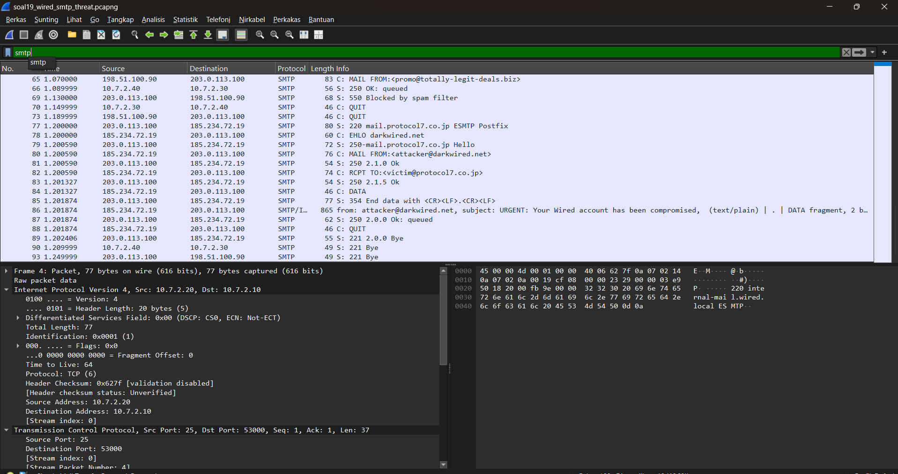
*Gambar 19.1: Paket transaksi SMTP pengiriman surat ancaman.*

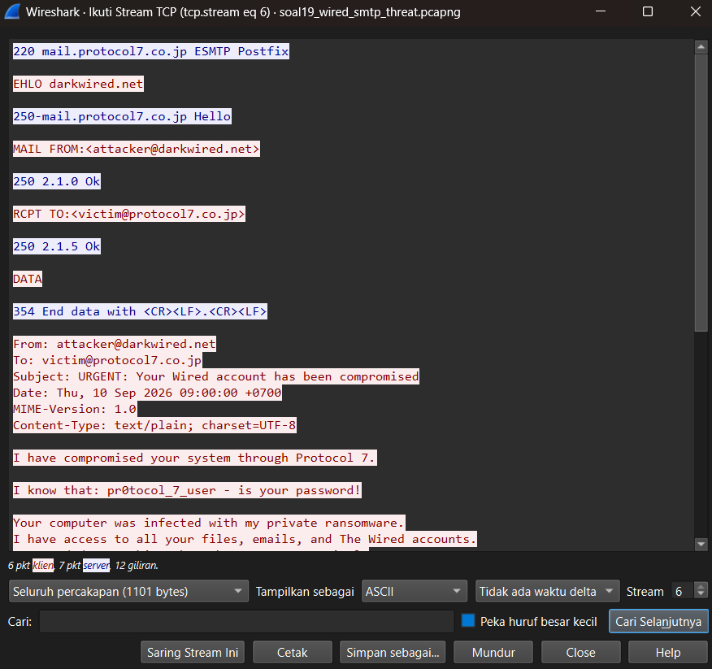
*Gambar 19.2: Isi percakapan lengkap email ancaman dan parameter pemerasan.*

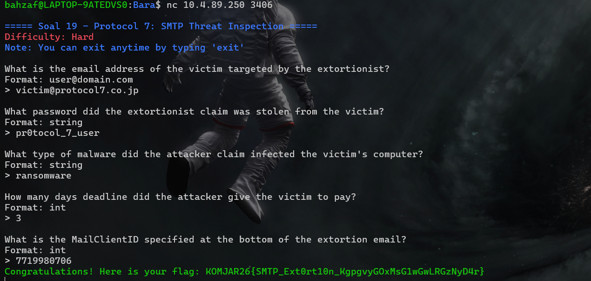
*Gambar 19.3: Validasi jawaban lewat nc 10.4.89.250 3406 dan flag.*

### 4. Hasil Flag
```text
KOMJAR26{SMTP_Ext0rt10n_KgpgvyGDxMsG1wGwLRGzNyD4r}
```

---

## Soal 20 - Protocol 7: TLS Decrypted Stream

### 1. Deskripsi & Langkah Analisis
Melakukan dekripsi sesi jaringan terenkripsi TLS untuk menganalisis muatan HTTP di dalamnya.
1. Pasang display filter `tls` di Wireshark untuk memeriksa proses negosiasi handshake aman dan mencatat IP server HTTPS serta versi TLS yang digunakan.
2. Masukkan file log kunci enkripsi (*pre-master secret*) ke Wireshark:
   * Buka menu **Edit** $\rightarrow$ **Preferences...**
   * Pilih menu **Protocols** $\rightarrow$ **TLS**.
   * Pada kolom **(Pre)-Master-Secret log filename**, klik **Browse** lalu arahkan ke file `.log` / `.txt` kunci SSL/TLS yang disediakan. Klik **OK**.
3. Setelah sesi terdekripsi otomatis oleh Wireshark, cari paket HTTP yang muncul, klik kanan lalu pilih **Follow** $\rightarrow$ **TLS Stream** (Stream 0).
4. Amati request method, domain Host / SNI, serta identitas User-Agent klien.

### 2. Poin-Poin Penemuan & Cara Analisis
* **Versi Protokol TLS:** `TLSv1.2`  
  *Cara Analisis:* Dilihat pada detail protokol paket `Server Hello` pada proses negosiasi TLS handshake.
* **Domain Name (SNI / Host):** `example.com`  
  *Cara Analisis:* Ditemukan pada ekstensi `server_name` pada paket `Client Hello` serta header `Host:` pada stream terdekripsi.
* **IP Server HTTPS:** `93.184.216.34`  
  *Cara Analisis:* Dilihat pada kolom **Destination IP** saat handshake TLS berlangsung ke port 443.
* **User-Agent Client:** `curl/7.62.0`  
  *Cara Analisis:* Terbaca jelas pada baris header `User-Agent:` di dalam jendela TLS Stream setelah didekripsi.
* **HTTP Request Method & Path:** `HEAD / HTTP/1.1`  
  *Cara Analisis:* Dilihat pada baris pertama HTTP request terdekripsi yang menggunakan metode request `HEAD`.

### 3. Dokumentasi Screenshot
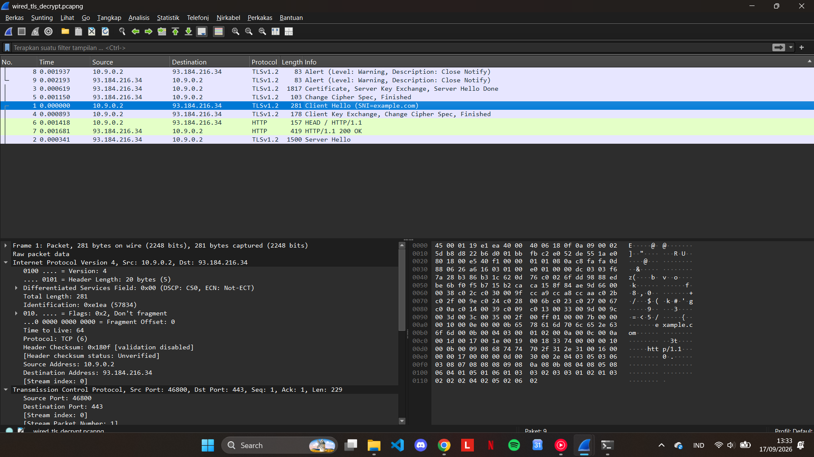
*Gambar 20.1: Paket negosiasi handshake TLSv1.2.*

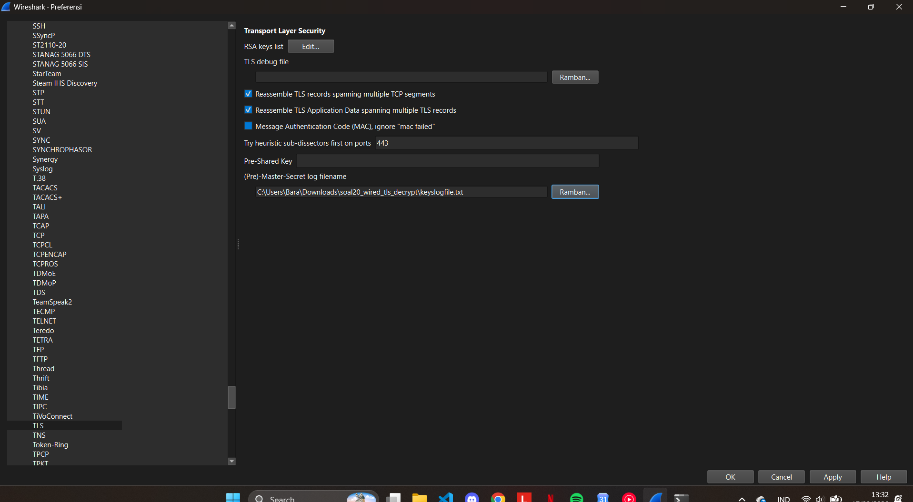
*Gambar 20.2: Pemasangan path Pre-Master Secret Log di Preferences Wireshark.*

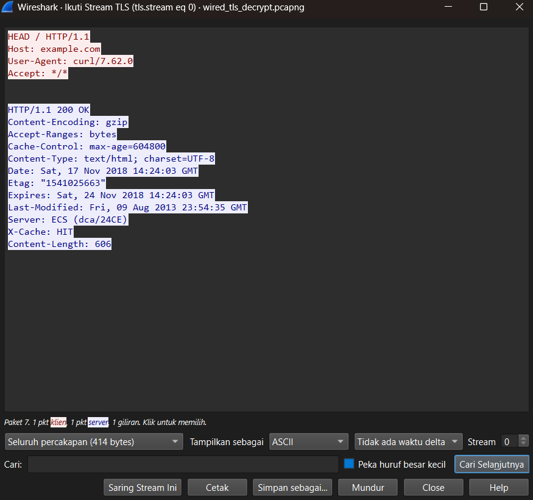
*Gambar 20.3: Stream transaksi terdekripsi (HEAD request dan curl User-Agent).*

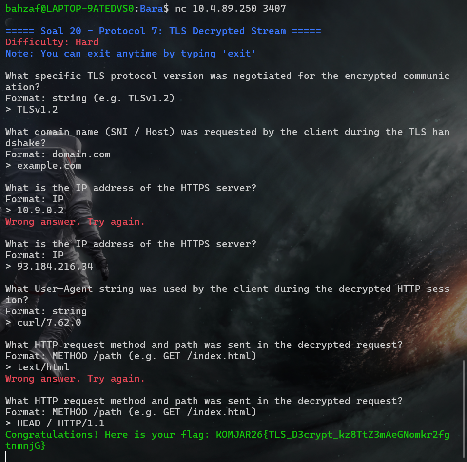
*Gambar 20.4: Pemasukan parameter di nc 10.4.89.250 3407 dan flag penutup.*

### 4. Hasil Flag
```text
KOMJAR26{TLS_D3crypt_kz8TtZ3mAeGNomkr2fgtnmnjG}
```
